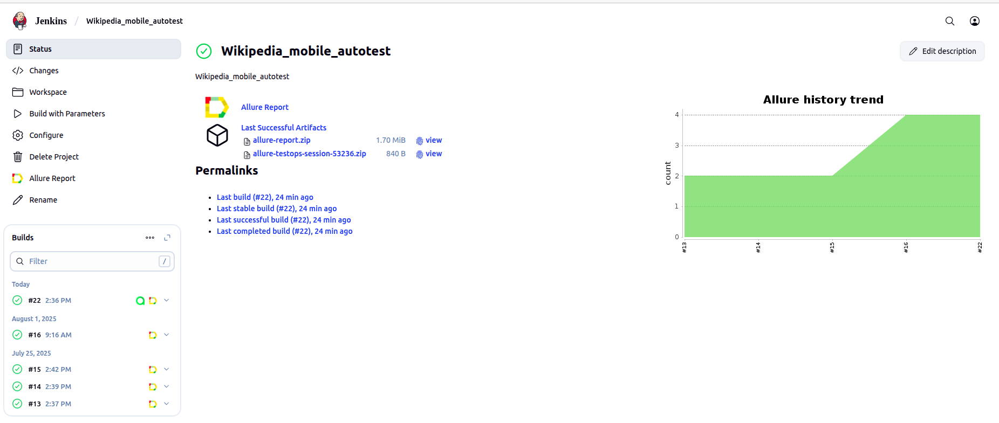
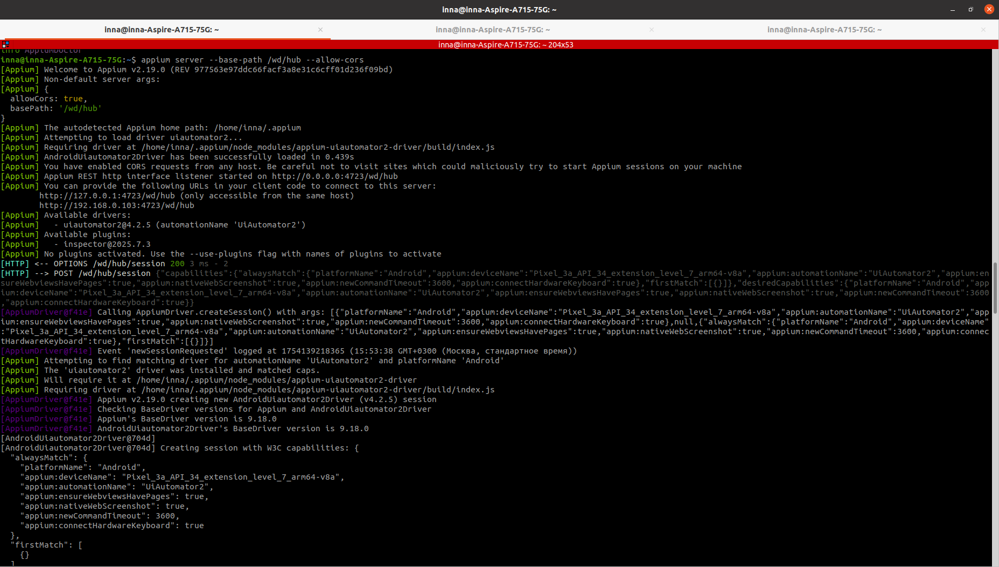
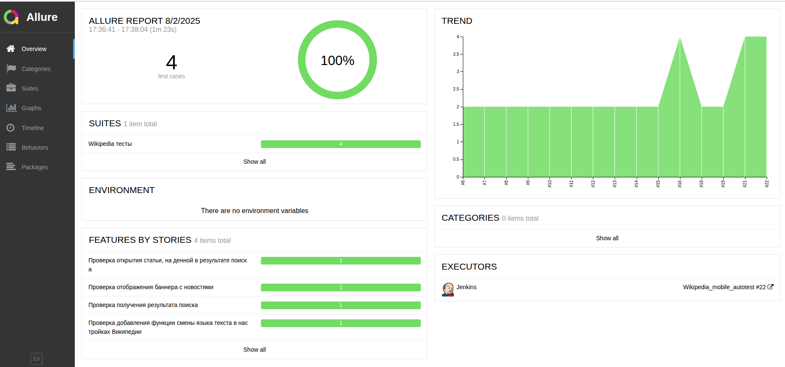
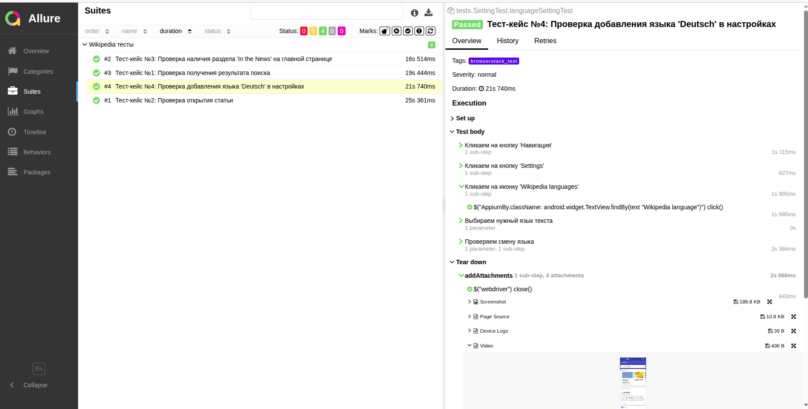
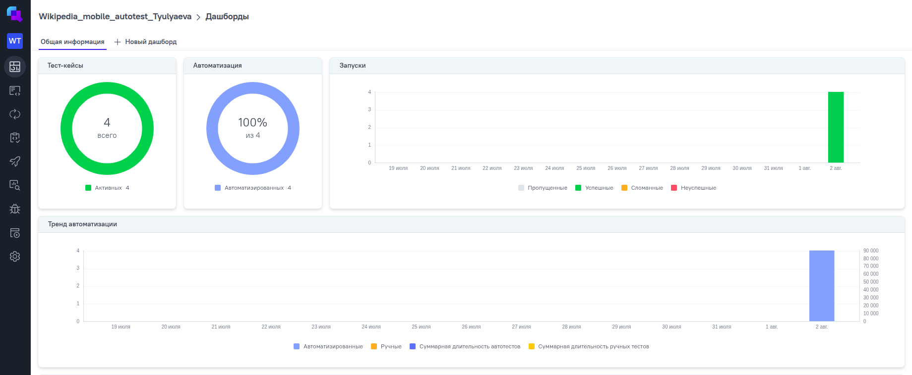
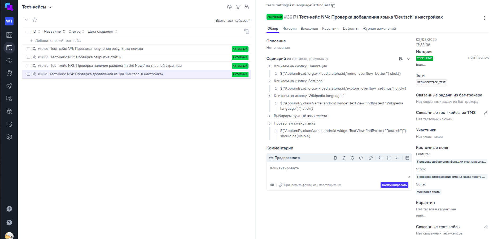
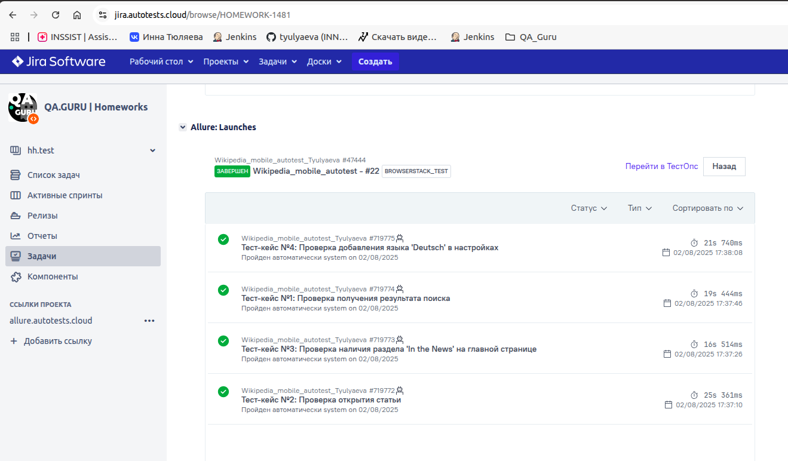
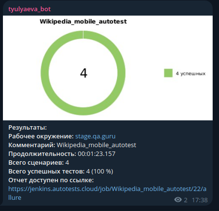

# Проект по автоматизации mobile тестов для приложения [Wikipedia](https://ru.wikipedia.org/)
<p align="center"><a href="https://ru.wikipedia.org/"></a></p>  

> Википедия - общедоступная многоязычная универсальная интернет-энциклопедия со свободным контентом, реализованная на принципах вики.

# 🧾 Содержание:

- <a href="#tools">Технологии и инструменты</a>
- <a href="#checking">Тестовые сценарии, реализованные в автоматизированных тест-кейсах</a>
- <a href="#jenkins">Сборка в Jenkins</a>
- <a href="#console">Запуск тестов (Из терминала)</a>
- <a href="#allureReport">Allure-отчет</a>
- <a href="#allure">Интеграция с Allure TestOps</a>
- <a href="#jira">Интеграция с Jira</a>
- <a href="#teleg"> Уведомление в Telegram о результатах выполнения автоматизированных тестов</a>
- <a href="#movie">Видеопример прохождения тестов Browserstack</a>


<a id="tools"></a>

## 🔨 Технологии и инструменты:

| Java                                                                                                    | IntelliJ  <br>  Idea                                                                                               | GitHub                                                                                                     | JUnit 5                                                                                                          | Gradle                                                                                                    | Allure <br> Report                                                                                                        | Appium                                                                                                   | Browserstack                                                                                                                   | Jenkins                                                                                                         | Jira                                                                                                                                  | Telegram                                                                                                         |                                                                                            Allure <br> TestOps |
|:--------------------------------------------------------------------------------------------------------|--------------------------------------------------------------------------------------------------------------------|------------------------------------------------------------------------------------------------------------|------------------------------------------------------------------------------------------------------------------|----------------------------------------------------------------------------------------------------------------------------------------------------------------------------------------------------------------------------|---------------------------------------------------------------------------------------------------------------------------|----------------------------------------------------------------------------------------------------------|--------------------------------------------------------------------------------------------------------------------------------|-----------------------------------------------------------------------------------------------------------------|---------------------------------------------------------------------------------------------------------------------------------------|------------------------------------------------------------------------------------------------------------------|---------------------------------------------------------------------------------------------------------------:|
| <a href="https://www.java.com/"></a> | <a href="https://www.jetbrains.com/idea/"></a> | <a href="https://github.com/"></a> | <a href="https://junit.org/junit5/"></a> | <a href="https://gradle.org/"></a>  | <a href="https://github.com/allure-framework"></a> | <a href="https://appium.io//"></a> | <a href="https://www.browserstack.com/"></a> | <a href="https://www.jenkins.io/"></a> | <a href="https://www.atlassian.com/software/jira/"></a> | <a href="https://web.telegram.org/"></a> | <a href="https://qameta.io/"></a> |

<a id="checking"></a>

---

## :clipboard: Тестовые сценарии

### Для локального запуска
- Тест-кейс №1: Проверка получения результата поиска

### Для удаленного запуска
- Тест-кейс №1: Проверка получения результата поиска
- Тест-кейс №2: Проверка открытия статьи
- Тест-кейс №3: Проверка наличия раздела 'In the News' на главной странице
- Тест-кейс №4: Проверка добавления языка 'Deutsch' в настройках

---

- Тесты в данном проекте написаны на языке <code>Java</code> с использованием фреймворка для тестирования [Selenide](https://selenide.org/), c применением паттерна Page Object.
- Сборщик - <code>Gradle</code>.
- <code>JUnit 5</code> задействован в качестве фреймворка модульного тестирования.
- При прогоне тестов для запуска используется [Android Studio](https://developer.android.com/), [Browserstack](https://www.browserstack.com/), драйвер Appium.
- В отчетах Allure для каждого теста (запускаемого удаленно) прикреплено видео прохождения теста.

---

<a id="jenkins"></a>
##  Сборка в [Jenkins](https://jenkins.autotests.cloud/job/Wikipedia_mobile_autotest/)

<p align="center">

</p>

---

<a id="console"></a>
## :rocket: Команды для запуска

### Локальный запуск (через эмулятор)

```bash
gradle clean local_test -Dhost=local_test
```

> Для запуска локальных тестов требуются следующие установленные программы на компьютере: Appium Server, Appium и Android Studio
<p align="center">  
  
</p> 
Пример запуска Appium сервера, с созданием локального порта.

### Удаленный запуск (через browserstack)

```bash
gradle clean browserstack_test -Dhost=browserstack_test
```

---

<a id="allureReport"></a>
##  </a>Интеграция с <a target="_blank" href="https://jenkins.autotests.cloud/job/Wikipedia_mobile_autotest/22/allure/">Allure Report</a>

## 🖨️ Основная страница отчёта

<p align="center">  
  
</p>  

## 📄 Тест-кейсы

<p align="center">  
   
</p>

---

<a id="allure"></a>
##  </a>Интеграция с <a target="_blank" href="https://allure.autotests.cloud/project/4848/dashboards">Allure TestOps</a>

## 🖨️ Основная страница отчёта

<p align="center">  
  
</p>  
На *Dashboard* в <code>Allure TestOps</code> видна статистика количества тестов: сколько из них добавлены и проходятся вручную, сколько автоматизированы. Новые тесты, а так же результаты прогона приходят по интеграции при каждом запуске сборки.


## 📄 Пример тест-кейса

<p align="center">  
  
</p>

---

<a id="jira"></a>

##  Интеграция с [Jira](https://jira.autotests.cloud/browse/HOMEWORK-1481)

Реализована интеграция <code>Allure TestOps</code> с <code>Jira</code>, в тикете отображается, какие тест-кейсы были написаны в рамках задачи и результат их прогона.
### Задача в Jira

<p align="center">

</p>

#### Содержание задачи

- Тест-кейсы из Allure TestOps
- Результат прогона тестов в Allure TestOps

---

<a id="teleg"></a>
##  Уведомления в Telegram чат с ботом

### Уведомление через чат бот

<p align="center">

</p>


#### Содержание уведомления в Telegram

- Окружение
- Комментарий
- Длительность прохождения тестов
- Общее количество сценариев
- Процент прохождения тестов
- Ссылка на Allure отчет

---

<a id="movie"></a>
## </a> Видеопример выполнения теста c Browserstack


<p align="center">
   
</p>
